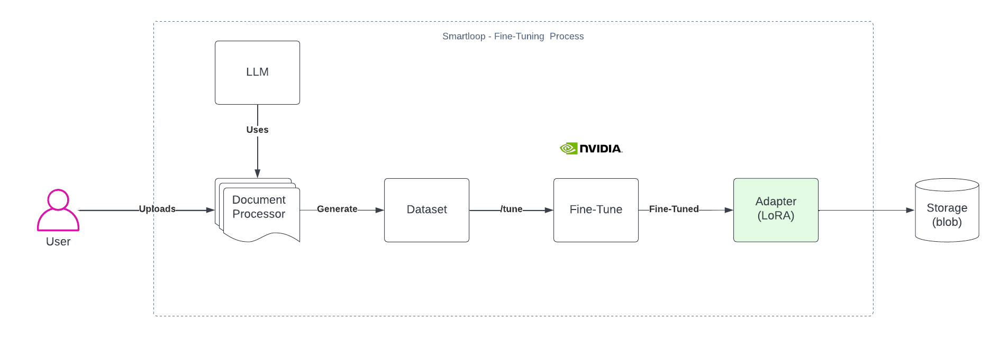

# Introduction

This guide will help you get started with platform , learn key concept and making the most of the prodcut

## What is Smartloop?

Smartloop AI is an open-source and no-code Small Language Model (SLM) platform designed to create domain-specific language models from custom sources. It aims to save costs, reduce energy consumption, and minimize hallucination in AI models.

Below is an overview how fine-tune happens behind the scene: 

## Contact
For more information, visit [Smartloop AI](https://smartloop.ai/) or reach out via email: hello@smartloop.ai.

---

© 2025 Smartloop Inc. | All rights reserved
