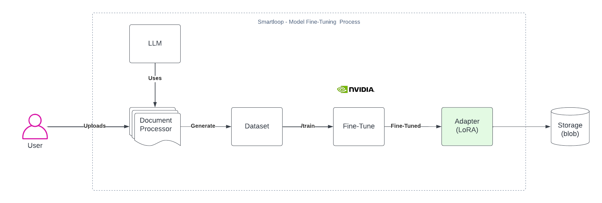

# Getting Started with SmartLoop

Welcome to SmartLoop! This guide will help you get started with creating conversational AI solutions using SmartLoop's platform.

## What is SmartLoop?

Smartloop AI is an open-source and no-code Small Language Model (SLM) platform designed to create domain-specific language models from custom sources. It aims to save costs, reduce energy consumption, and minimize hallucination in AI models.


Below is an overview how fine-tune happens behind the scene: 





## Installation

Install the CLI with the following command:

```
pip install -U smartloop

```

The Command Line Interface allows you upload, fine-tune and extract information from your documents with a few easy steps


